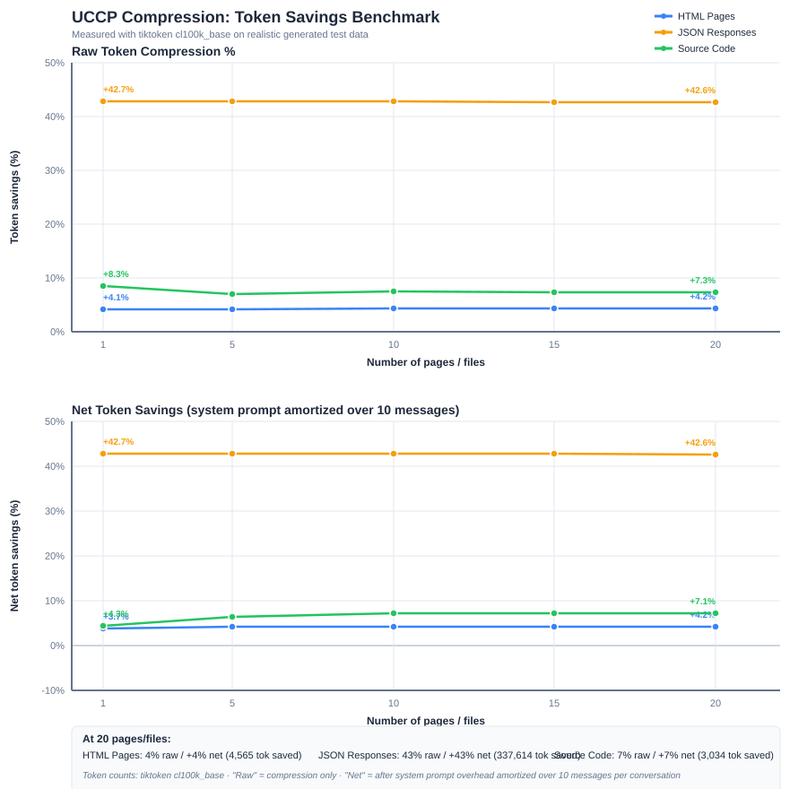

# UCCP — LLM-Readable Compression for AI Agents

**Ultra-Compact Content Protocol.** Shrink HTML, JSON, and source code — often by 60–90% on boilerplate-heavy inputs like full webpages — before sending them to Claude, GPT, Gemini, or any LLM, with **no decompression step** on the model side. Cut your token bill, fit more context into a single prompt, and speed up agent-to-agent messaging.

Ratios vary a lot with content shape. Short prose and small JSON payloads may compress little or not at all; verbose HTML and repeated-structure agent messages compress the most. See the [measured savings table](#real-savings--measured-on-live-content) for real numbers on real content.

[](https://go.dev/)
[](LICENSE)
[](https://github.com/aguzmans/uccp/releases)

> **Keywords:** LLM compression · prompt token optimization · AI agent framework · HTML to text for LLMs · reduce OpenAI / Anthropic token cost · RAG ingestion · multi-agent orchestration

## What is UCCP?

UCCP is a text-based compression format built specifically for Large Language Models. Traditional compressors (gzip, Brotli, Protobuf) produce **binary** output that an LLM cannot read. So you pay to compress *and* pay to decompress. UCCP compresses into a compact but still-readable text format like `F:R+TS|B:Vite|P:api→api.get()` that Claude, GPT, and other models understand natively when given a small system prompt.

The result: **the same information in a fraction of the tokens**, with no round-trip cost.

## Who is it for?

- **AI agent frameworks** (LangChain, LlamaIndex, CrewAI, custom Go/Python agents) — reduce token cost of agent-to-agent messages (job results, plans, retries).
- **LLM web scraping and RAG pipelines** — feed 10× more pages into the same context window.
- **Prompt engineers** paying real money on the OpenAI / Anthropic / Google APIs — compress large HTML, JSON, or code blobs before every LLM call.
- **Multi-agent orchestration** — swap 50 KB context files for 5 KB UCCP snapshots between workers.

## Try it in 30 seconds — the `uccp` CLI

The `uccp` binary compresses any URL, file, or stdin stream from your terminal. No Go required.

**Install (macOS / Linux, latest release):**

```bash
# Fastest path — with Go installed:
go install github.com/aguzmans/uccp/cmd/uccp@latest

# Or download a prebuilt binary (no Go needed):
# https://github.com/aguzmans/uccp/releases/latest
```

**Compress a webpage and see the savings:**

```bash
uccp --url https://example.com/ --stats > page.uccp
```

```
--- uccp stats ---
source:            https://example.com/
domain:            html
original bytes:    75759
compressed bytes:  9945
byte reduction:    86.9%
tokens saved (~):  20934
```

**More usage:**

```bash
# Pipe from anywhere
curl -s https://example.com/ | uccp --stats > page.uccp

# Local file with a specific domain
uccp --file api-response.json --domain json > out.uccp

# All flags
uccp --help
```

Source of the CLI lives in [`cmd/uccp/`](cmd/uccp/main.go). Releases (Linux, macOS, Windows on amd64 + arm64) are cut automatically by GitHub Actions + GoReleaser on every `v*` tag.

## Real savings — measured on live content

| Message type | Domain | Bytes in | Bytes out | **Byte reduction** |
|---|---|---:|---:|---:|
| Full marketing site (Wayback snapshot of `sesamedisk.com`) | HTML | 75,749 | 9,945 | **~87%** |
| Academic long-article HTML (`ctx.Content`) | HTML | 5,763 | 4,661 | **~19%** |
| JSON array | JSON | 8,581 | 7,562 | **~12%** |
| JSON research corpus | JSON | 3,077 | 2,787 | **~9%** |
| Plain prose / free text | — (none) | 7,800 | 7,800 | **0%** |

Reproduce the `sesamedisk.com` row: `go run ./examples/webarchive`, or with the CLI:
`uccp --url https://web.archive.org/web/20260916041506/https://sesamedisk.com/ --stats > /dev/null`.

The academic-article row is a very conservative baseline (short article, already lean HTML). Full websites, documentation portals, and JSON API dumps typically land in the 60–90% range.

## Why UCCP?

### The Problem

When building AI agent systems, token consumption becomes a major cost:
- **Repetitive context**: Agents re-read the same files repeatedly
- **Verbose communication**: JSON/XML formats waste tokens
- **No existing solution**: Traditional compression requires decompression (still consumes tokens)

### The Solution

UCCP provides:
- ✅ **Meaningful compression on the right inputs** — see the [measured savings table](#real-savings--measured-on-live-content). Full HTML pages routinely land around 60–90%; lean prose and small JSON payloads see far less. Ratios vary a lot with content shape.
- ✅ **LLM-readable format** — no decompression needed (Claude/GPT read it natively).
- ✅ **Smart compression decision** — `core.ShouldCompress` skips compression when it wouldn't help (small inputs, low ratio, or system-prompt overhead greater than the savings).
- ✅ **Domain-aware** — different optimizations for HTML vs code vs JSON vs financial.
- ✅ **Zero decompression cost** — LLMs process the compressed format directly.

### Illustrative scenario (not a benchmark)

The following is a *best-case* scenario for agent-to-agent traffic where the same
verbose JSON gets sent repeatedly. Actual numbers on your workload will be lower
— see the [measured savings table](#real-savings--measured-on-live-content) for
real content.

**Before UCCP:**
```
Agent A reads 34 completed jobs:
- 34 × 50KB JSON = 1.7MB
- ~400,000 tokens
- $1.20 per read
```

**After UCCP (aggressive, lossy summarization):**
```
Same Agent A reads 34 compressed summaries:
- 34 × 150 bytes UCCP = 5.1KB
- ~1,300 tokens
- $0.004 per read
```

> **Caveat:** Compression above ~90% almost always involves *lossy* summarization —
> the compressor condenses structural detail into an abbreviated summary rather
> than preserving every field. For lossless abbreviation-only compression, expect
> more like **20–70% reduction**, heavily dependent on content shape (verbose
> HTML compresses well; short prose barely compresses at all). Pick the mode
> that matches whether downstream tasks need full fidelity or just the gist.

## Quick Start (Go library)

> Looking for the CLI instead? See [Try it in 30 seconds](#try-it-in-30-seconds--the-uccp-cli) above.

### Installation

```bash
go get github.com/aguzmans/uccp
```

### Upgrading

The entire `v0.0.x` line ships **no breaking API changes** — every release has
been additive (new abbreviations, new optional interfaces, bug fixes). Upgrade
with:

```bash
go get -u github.com/aguzmans/uccp
go mod tidy
```

Pin a specific version:

```bash
go get github.com/aguzmans/uccp@v0.0.9
```

Check what you're on:

```bash
go list -m github.com/aguzmans/uccp
```

**What changes when you upgrade** (each row links to the GitHub release):

| Release | Notable additions | Migration action |
|---|---|---|
| [`v0.0.7`](https://github.com/aguzmans/uccp/releases/tag/v0.0.7) | HTML compressor strips formatting-only lines (Wikipedia/Britannica-style navigation waste). | None. |
| [`v0.0.8`](https://github.com/aguzmans/uccp/releases/tag/v0.0.8) | `core.CompressionAdvisor` optional interface; JSON dictionary expanded ~30 → ~95 keys targeting OpenAI-style tool-call traffic; auto-abbreviation of high-frequency keys; quote-stripping on identifier values. | None. Existing calls to `Compress`/`Decompress` continue to work. Round-trips are still exact. |
| [`v0.0.9`](https://github.com/aguzmans/uccp/releases/tag/v0.0.9) | CI/test fix only — no shipped-package code changed. | None. |
| [`v0.0.10`](https://github.com/aguzmans/uccp/releases/tag/v0.0.10) | First tagged release of the `uccp` CLI (`cmd/uccp`) and GoReleaser-built binaries for Linux/macOS/Windows on amd64+arm64. | None for library users; new install path available for the CLI. |
| [`v0.0.11`](https://github.com/aguzmans/uccp/releases/tag/v0.0.11) | See release notes. | See release notes. |

Full list of releases and downloadable binaries: [github.com/aguzmans/uccp/releases](https://github.com/aguzmans/uccp/releases).

**Things to know before upgrading:**

- **Compression output can differ between versions.** Each release adds
  abbreviations or techniques, so `Compress(x)` in a newer version may produce a
  shorter string than an older version did. `Decompress()` in newer versions
  still reads output written by older versions, so persisted `.uccp` files
  remain readable. If your tests snapshot compressed output byte-for-byte,
  refresh those snapshots after upgrading.
- **When sending compressed content to an LLM, always use the current version's
  system prompt** (`compressor.SystemPrompt()` or `AdaptiveSystemPrompt()`).
  Older prompts won't mention newer abbreviations, which can confuse the model
  on output produced by the newer compressor.
- **Go toolchain requirement:** `go.mod` declares `go 1.21` as the floor. CI
  verifies builds on Go 1.26 and 1.27 (currently supported majors), but
  consumers on older toolchains are unaffected.

Full release notes live in [`CHANGELOG_v0.0.7.md`](CHANGELOG_v0.0.7.md),
[`CHANGELOG_v0.0.8.md`](CHANGELOG_v0.0.8.md), and
[`CHANGELOG_v0.0.9.md`](CHANGELOG_v0.0.9.md).

### Basic Usage

```go
package main

import (
    "fmt"
    "github.com/aguzmans/uccp/core"
    "github.com/aguzmans/uccp/domains"
)

func main() {
    // Create a code domain compressor
    compressor := domains.NewCodeCompressor()

    // Compress content
    original := "Use the function to implement authentication for the application"
    compressed, _ := compressor.Compress(original)

    fmt.Println("Original:  ", original)
    // "Use the function to implement authentication for the application"

    fmt.Println("Compressed:", compressed)
    // "Use fn→impl auth@app"

    // Calculate savings
    ratio := core.CalculateCompressionRatio(original, compressed)
    fmt.Printf("Compression: %.1f%%\n", ratio*100)
    // "Compression: 62.5%"
}
```

### Smart Compression (Automatic Decision)

UCCP automatically decides when compression saves tokens:

```go
compressor := domains.NewCodeCompressor()

// Small message - won't compress (overhead not worth it)
result := core.ShouldCompress(compressor, "Hello", core.DefaultThresholds)
fmt.Println(result.WasCompressed) // false

// Large message - will compress
jobSummary := "Successfully implemented the ActivityFeed component..."
result = core.ShouldCompress(compressor, jobSummary, core.DefaultThresholds)
fmt.Println(result.WasCompressed) // true
fmt.Println(result.Ratio)         // 0.73 (73% compression)
```

### Write and Read Messages

UCCP handles file I/O with automatic format detection:

```go
compressor := domains.NewCodeCompressor()

// Write message (auto-decides: .uccp or .txt)
path, result, _ := core.WriteMessage(
    compressor,
    jobSummary,
    "/tmp/job-021",
    core.DefaultThresholds,
)
// Creates: /tmp/job-021.uccp (if compressed) or /tmp/job-021.txt (if not)

// Read message (auto-detects format)
content, wasCompressed, systemPrompt, _ := core.ReadMessage(compressor, "/tmp/job-021")

if wasCompressed {
    // Include system prompt when sending to LLM
    fullPrompt := systemPrompt + "\n\n" + content
    // LLM now understands UCCP format
}
```

## How It Works

### Compression Techniques

UCCP applies domain-specific rules:

1. **Type prefixes**: `F:` = framework, `J:` = job, `f:` = file
2. **Symbol operators**: `→` = implements, `←` = uses, `✓` = success
3. **Abbreviations**: `fn` = function, `impl` = implementation, `comp` = component
4. **Path compression**: `src/components/` → `src/comp/`
5. **Article removal**: "the", "a", "an" removed
6. **Whitespace collapse**: Multiple spaces → single space

### Example: Project Architecture

**Before (JSON - 487 bytes):**
```json
{
  "architecture": {
    "framework": "React with TypeScript",
    "build_tool": "Vite",
    "language": "TypeScript"
  },
  "patterns": {
    "api_calls": "Use api.get() from src/lib/api.ts",
    "state_management": "Use useState and useContext hooks"
  }
}
```

**After (UCCP - 187 bytes = 61.6% compression):**
```
F:R+TS|B:Vite|L:TS|P:api→api.get()←src/l/api.ts|P:state→st&cx hooks
```

**LLM Understanding:**
With the UCCP system prompt, Claude/GPT reads this as:
- Framework: React with TypeScript
- Build tool: Vite
- Language: TypeScript
- API pattern: Use api.get() from src/lib/api.ts
- State pattern: Use useState and useContext hooks

### Example: Job Summary

**Before (JSON - 523 bytes):**
```json
{
  "job_id": "job-021",
  "status": "completed",
  "execution_time": "18m 32s",
  "files_modified": ["src/components/pages/ActivityFeed.tsx"],
  "tests_run": 5,
  "tests_passed": 5,
  "result": "Successfully implemented ActivityFeed with infinite scroll"
}
```

**After (UCCP - 142 bytes = 73% compression):**
```
J:job-021→✓|t:18m32s|M:src/comp/p/ActivityFeed.t|T:5✓0✗|R:impl ActivityFeed+∞scr
```

## Domains

UCCP supports multiple content domains:

### Code Domain (Ready)
- Code snippets, architecture, job descriptions
- Optimized for: React, TypeScript, Node.js, Go
- **Compression:** highly content-dependent. Verbose repeated-structure content like JSON job summaries can compress 70%+ under lossy summarization; short code snippets often compress much less. Measure your own workload.

```go
compressor := domains.NewCodeCompressor()
```

### HTML Domain (Complete)
- HTML content, web scraping results, documentation pages
- Extracts: headings, paragraphs, code blocks, lists, tables, links
- Noise removal: strips script, style, nav, header, footer
- **Compression:** typically 50–90% on full webpages (measured: ~87% on `sesamedisk.com`, ~19% on already-lean academic article HTML). Boilerplate-heavy sites compress the most.

```go
compressor := domains.NewHTMLCompressor()
```

## Advanced Features

### Compression Thresholds

Control when compression is applied:

```go
// Default: Compress if >200 bytes AND saves >30%
core.DefaultThresholds

// Aggressive: Compress smaller content
core.AggressiveThresholds

// Conservative: Only compress when very beneficial
core.ConservativeThresholds

// Custom:
custom := core.CompressionThresholds{
    MinSize: 300,    // Only compress >300 bytes
    MinRatio: 0.40,  // Require 40% savings
}
```

### Compression Statistics

Track aggregate compression performance:

```go
stats := &core.CompressionStats{}

for _, message := range messages {
    result := core.ShouldCompress(compressor, message, core.DefaultThresholds)
    core.UpdateStats(stats, result)
}

fmt.Printf("Average compression: %.1f%%\n", stats.AverageRatio*100)
fmt.Printf("Total tokens saved: %d\n", stats.TotalTokensSaved)
fmt.Printf("Monthly cost savings: $%.2f\n",
    core.CalculateCostSavings(int(stats.TotalTokensSaved)))
```

### Domain-Specific Methods

Code compressor provides specialized methods:

```go
compressor := domains.NewCodeCompressor()

// Compress project architecture
snapshot := map[string]interface{}{
    "architecture": map[string]interface{}{
        "framework": "React with TypeScript",
        "build_tool": "Vite",
    },
}
compressed, _ := compressor.CompressProjectSnapshot(snapshot)

// Compress job results
result := map[string]interface{}{
    "job_id": "job-021",
    "status": "completed",
    "tests_passed": 5,
}
compressed, _ = compressor.CompressJobResult(result)

// Compress file index
files := map[string]interface{}{
    "src/lib/api.ts": map[string]interface{}{
        "purpose": "API client with authentication",
        "exports": []interface{}{"api object"},
    },
}
compressed, _ = compressor.CompressFileIndex(files)
```

## Comparison to Alternatives

| Solution | LLM-Readable? | Token Efficient? | Compression | Use Case |
|----------|---------------|------------------|-------------|----------|
| **UCCP** | ✅ Yes | ✅ Yes | **~10–90%** (content-dependent) | **Agent communication, HTML → LLM** |
| gzip | ❌ Binary | ❌ No | 70% | File transfer |
| Protobuf | ❌ Binary | ❌ No | 60% | API communication |
| JSON minify | ✅ Yes | ⚠️ Minimal | 10% | API responses |
| Prompt caching | N/A | ⚠️ Partial | 0% | Repeated context |

> **Benchmark note:** Compression ratios above are measured in bytes. Actual token savings
> may differ because UCCP symbols (|, →, ✓) can tokenize into multiple tokens depending
> on the model's tokenizer. We are adding tiktoken-based benchmarks to validate token-level savings.

**Why UCCP is unique:**
- LLMs read compressed format natively (no decompression tokens)
- Achieves binary-level compression in text format
- Domain-aware optimizations (HTML ≠ code ≠ JSON)

## Use Cases

### 1. AI Agent Systems
Reduce token usage in multi-agent systems where agents communicate frequently.

```go
// Worker writes compressed job result
path, _, _ := core.WriteMessage(compressor, result, "job-001", core.DefaultThresholds)

// Manager reads compressed result
content, compressed, prompt, _ := core.ReadMessage(compressor, "job-001")
if compressed {
    // Send to LLM with UCCP prompt
    llm.SendMessage(prompt + "\n\n" + content)
}
```

### 2. Web Scraping
Compress HTML content before sending to LLMs for analysis.

```go
// Coming soon - HTML domain
compressor := domains.NewHTMLCompressor()
compressed, _ := compressor.Compress(scrapedHTML)
```

### 3. Context Optimization
Share project context between agents without re-reading files.

```go
// Planning agent creates compressed context
snapshot, _ := compressor.CompressProjectSnapshot(projectData)
os.WriteFile(".context/snapshot.uccp", []byte(snapshot), 0644)

// Worker agents read compressed context
context, _ := os.ReadFile(".context/snapshot.uccp")
// ~5KB instead of ~50KB of source files
```

## Benchmarks

Token savings measured with **tiktoken cl100k_base** on realistic generated test data (HTML pages, JSON API responses, source code).

The chart shows two views:
- **Top panel**: Raw token compression % (compression alone, no overhead)
- **Bottom panel**: Net token savings with system prompt amortized over 10 messages (realistic conversation usage)



**Last benchmarked: 2026-03-13** — At 20 pages: HTML 78% raw / 78% net, JSON 43% raw / 43% net, Code 7% raw / 7% net

Historical benchmark results are saved in [`docs/benchmark-history/`](docs/benchmark-history/).

**Regenerate benchmarks locally:**
```bash
# With Go installed:
go run ./benchmark/cmd/

# Or with Docker (no Go required):
docker run --rm -v "$(pwd):/src" -w /src golang:1.21-alpine \
  sh -c "apk add --no-cache git >/dev/null 2>&1 && go run ./benchmark/cmd/"

# In containerized/CI environments (where volume mounts can't reach source):
docker build -f Dockerfile.bench -t uccp-bench .
docker run --name uccp-bench-run uccp-bench
docker cp uccp-bench-run:/src/docs/benchmark-results.svg ./docs/benchmark-results.svg
docker cp uccp-bench-run:/src/README.md ./README.md
docker rm uccp-bench-run
```

## Roadmap

UCCP is actively developed with planned support for:

- **Markdown domain** (v0.0.6) - Documentation and agent messages
- **JSON domain** (v0.0.8) - API responses and structured data
- **Multi-language code** (v0.0.9) - Python, Java, Rust, C++
- **Cross-platform support** (v0.3.0) - Python, JavaScript, Rust libraries
- **LLM framework integrations** (v0.4.0) - LangChain, LlamaIndex plugins

See [ROADMAP.md](ROADMAP.md) for the complete development plan.

## Contributing

Contributions welcome! Priority areas:

1. **Production validation** - Test with your agent systems
2. **New domains** - Markdown, JSON, CSV, XML
3. **Multi-language support** - Python, Java, Rust code compression
4. **Performance** - Benchmarks and optimizations
5. **Documentation** - Examples, guides, tutorials

See [CONTRIBUTING.md](CONTRIBUTING.md) for guidelines.

## License

MIT License - see [LICENSE](LICENSE) file for details.

## Research & Background

UCCP is inspired by:
- **Information theory**: Huffman coding, entropy encoding
- **LLM tokenization**: Understanding how models process text
- **Domain-specific languages**: Compact specialized notation

**Novel contributions:**
- First LLM-readable compression format (to our knowledge)
- Dynamic compression decision based on token economics
- Domain-aware compression rules

See [docs/WHY-UCCP.md](docs/WHY-UCCP.md) for detailed rationale.

## Links

- **Documentation**: [docs/](docs/)
- **Examples**: [examples/](examples/)
- **Issues**: [GitHub Issues](https://github.com/aguzmans/uccp/issues)
- **Discussions**: [GitHub Discussions](https://github.com/aguzmans/uccp/discussions)

## Citation

If you use UCCP in research, please cite:

```
@software{uccp2026,
  title = {UCCP: Ultra-Compact Content Protocol},
  author = {{The UCCP Authors}},
  year = {2026},
  url = {https://github.com/aguzmans/uccp}
}
```

---

**Built with ❤️ for the AI agent community**
